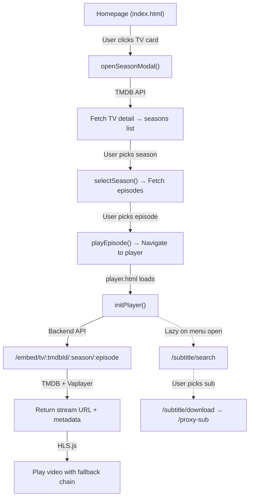

# 📺 TV Series Episode Selection — Full Flow Walkthrough

> **Tujuan:** Dokumentasi lengkap untuk porting fitur pemilihan episode TV/serial dari codebase VidMirror/MasdiFox ke codebase lain.

---

## 🏗️ Architecture Overview



---

## 📁 File Map

| Layer | File | Peran |
|-------|------|-------|
| **Homepage** | [index.html](file:///c:/Users/dimas/Videos/vidmirror/frontend/embed/index.html) | Browsing, search, season/episode modal |
| **Player** | [player.html](file:///c:/Users/dimas/Videos/vidmirror/frontend/embed/player.html) | Video player + episode nav + subtitle |
| **Routes** | [stream.js](file:///c:/Users/dimas/Videos/vidmirror/backend/src/routes/stream.js) | Express router: `/embed/tv/:tmdbId/:season/:episode` |
| **Controller** | [streamController.js](file:///c:/Users/dimas/Videos/vidmirror/backend/src/controllers/streamController.js) | Orchestrates TMDB + stream lookup |
| **TMDB Service** | [tmdb.js](file:///c:/Users/dimas/Videos/vidmirror/backend/src/services/tmdb.js) | `getMediaInfo`, `getEpisodeInfo`, `getSeasonInfo` |
| **Stream Service** | [streamFinder.js](file:///c:/Users/dimas/Videos/vidmirror/backend/src/services/streamFinder.js) | `findStream()` → Vaplayer API |
| **Serverless (Vercel)** | [api/index.js](file:///c:/Users/dimas/Videos/vidmirror/api/index.js) | All-in-one serverless version (same logic) |
| **Vercel Config** | [vercel.json](file:///c:/Users/dimas/Videos/vidmirror/vercel.json) | Route rewrites |
| **Env** | [.env](file:///c:/Users/dimas/Videos/vidmirror/.env) | API keys & tokens |

---

## 🔄 Step-by-Step Flow

### Step 1: Deteksi Movie vs Series (Homepage)

**File:** [index.html:373-406](file:///c:/Users/dimas/Videos/vidmirror/frontend/embed/index.html#L373-L406)

Saat user browse TMDB, `createCard()` memeriksa `type` parameter:

```javascript
function createCard(item, type) {
  if (type === 'movie') {
    // MOVIE → langsung navigate ke player
    card.onclick = () => {
      window.location.href = `/embed/player.html?id=${item.id}&type=movie`;
    };
  } else {
    // TV SERIES → buka modal pilih season/episode
    card.onclick = () => openSeasonModal(item);
  }
}
```

> [!IMPORTANT]
> **Branching point utama:** Movie langsung ke player, TV series membuka modal season/episode terlebih dahulu.

---

### Step 2: Fetch Daftar Season (Frontend → TMDB Direct)

**File:** [index.html:459-504](file:///c:/Users/dimas/Videos/vidmirror/frontend/embed/index.html#L459-L504)

**Fungsi:** `openSeasonModal(item)`

**TMDB Endpoint yang dipanggil (langsung dari frontend):**
```
GET https://api.themoviedb.org/3/tv/{tmdb_id}?api_key={KEY}&language=id-ID
```

**Contoh Response (partial):**
```json
{
  "id": 76479,
  "name": "The Boys",
  "seasons": [
    { "season_number": 0, "episode_count": 12, "name": "Specials" },
    { "season_number": 1, "episode_count": 8, "name": "Season 1" },
    { "season_number": 2, "episode_count": 8, "name": "Season 2" },
    { "season_number": 3, "episode_count": 8, "name": "Season 3" }
  ],
  "poster_path": "/stTEycfG9Oa...jpg"
}
```

**Logic penting:**
```javascript
// Filter season 0 (Specials) — hanya tampilkan season reguler
const seasons = (data.seasons || []).filter(s => s.season_number > 0);

// Render season list ke sidebar modal
seasons.forEach(s => {
  el.textContent = 'Season ' + s.season_number;
  el.dataset.season = s.season_number;
  el.dataset.count  = s.episode_count;  // fallback jumlah episode
  el.onclick = () => selectSeason(s.season_number, s.episode_count, el);
});

// Auto-click season pertama
const first = seasonEl.querySelector('.season-item');
if (first) first.click();
```

---

### Step 3: Fetch Daftar Episode (Frontend → TMDB Direct)

**File:** [index.html:507-538](file:///c:/Users/dimas/Videos/vidmirror/frontend/embed/index.html#L507-L538)

**Fungsi:** `selectSeason(seasonNum, episodeCount, el)`

**TMDB Endpoint:**
```
GET https://api.themoviedb.org/3/tv/{tmdb_id}/season/{season_number}?api_key={KEY}&language=id-ID
```

**Contoh Response (partial):**
```json
{
  "season_number": 1,
  "episodes": [
    { "episode_number": 1, "name": "The Name of the Game" },
    { "episode_number": 2, "name": "Cherry" },
    { "episode_number": 3, "name": "Get Some" }
  ]
}
```

**Logic + fallback:**
```javascript
// Jika TMDB season detail gagal, generate episode list dari episode_count
const episodes = data.episodes || 
  Array.from({length: episodeCount}, (_, i) => ({episode_number: i+1}));

episodes.forEach(ep => {
  div.textContent = ep.episode_number;
  div.onclick = () => playEpisode(seasonNum, ep.episode_number);
});
```

> [!TIP]
> **Edge case:** Jika TMDB `/tv/{id}/season/{n}` gagal (404 atau timeout), kode fallback ke `episodeCount` dari Step 2 untuk generate grid nomor episode tanpa nama.

---

### Step 4: Navigate ke Player

**File:** [index.html:541-543](file:///c:/Users/dimas/Videos/vidmirror/frontend/embed/index.html#L541-L543)

```javascript
function playEpisode(season, episode) {
  window.location.href = `/embed/player.html?id=${modalItem.id}&type=tv&s=${season}&e=${episode}`;
}
```

**URL Pattern:**
```
/embed/player.html?id=76479&type=tv&s=1&e=3
```

**Query params:**
| Param | Deskripsi | Default |
|-------|-----------|---------|
| `id` | TMDB ID | `76479` |
| `type` | `tv` atau `movie` | `tv` |
| `s` | Season number | `1` |
| `e` | Episode number | `1` |

---

### Step 5: Player Init — Parse Params & Fetch Stream

**File:** [player.html:260-266](file:///c:/Users/dimas/Videos/vidmirror/frontend/embed/player.html#L260-L266)

```javascript
const urlParams = new URLSearchParams(window.location.search);
let tmdbId    = urlParams.get('id') || '76479';
let mediaType = urlParams.get('type') || 'tv';
let season    = parseInt(urlParams.get('s') || 1);
let episode   = parseInt(urlParams.get('e') || 1);
let maxEpisode = 99;
```

**File:** [player.html:316-378](file:///c:/Users/dimas/Videos/vidmirror/frontend/embed/player.html#L316-L378) — `initPlayer()`

```javascript
async function initPlayer() {
  // Sembunyikan episode nav untuk movie
  if (mediaType === 'movie') {
    episodeNavEl.style.display = 'none';
  } else {
    episodeNavEl.style.display = 'flex';
    updateEpLabel();  // Tampilkan "S1E3"
  }

  // Build API URL berdasarkan type
  const apiUrl = mediaType === 'movie'
    ? `${API_BASE}/embed/movie/${tmdbId}`
    : `${API_BASE}/embed/tv/${tmdbId}/${season}/${episode}`;

  const r = await fetch(apiUrl);
  const data = await r.json();
  
  // Untuk TV: update maxEpisode dari totalEpisodes
  if (mediaType !== 'movie') {
    if (data.totalEpisodes) maxEpisode = data.totalEpisodes;
  }
  
  // Load HLS stream with fallback chain
  loadHLSChain([data.streamUrl, renderProxy, cfProxy]);
}
```

---

### Step 6: Backend — Endpoint `/embed/tv/:tmdbId/:season/:episode`

**File (local):** [streamController.js:5-36](file:///c:/Users/dimas/Videos/vidmirror/backend/src/controllers/streamController.js#L5-L36)
**File (Vercel):** [api/index.js:96-115](file:///c:/Users/dimas/Videos/vidmirror/api/index.js#L96-L115)

**Route definition:** [stream.js:7](file:///c:/Users/dimas/Videos/vidmirror/backend/src/routes/stream.js#L7)
```javascript
router.get('/tv/:tmdbId/:season/:episode', getEmbed);
```

**Controller logic:**
```javascript
async function getEmbed(req, res) {
  const { tmdbId, season = 1, episode = 1 } = req.params;

  // Parallel fetch: media info + episode detail
  const [mediaInfo, episodeInfo] = await Promise.all([
    getMediaInfo(tmdbId, 'tv'),           // TMDB /tv/{id}
    getEpisodeInfo(tmdbId, season, episode) // TMDB /tv/{id}/season/{s}/episode/{e}
  ]);

  // Sequential: season info (for totalEpisodes)
  const seasonInfo = await getSeasonInfo(tmdbId, season);
  
  // Stream lookup (Vaplayer API)
  const streamUrl = await findStream(tmdbId, 'tv', season, episode);

  res.json({
    success: true,
    type: 'tv',
    title: mediaInfo?.name || 'Unknown Title',
    episodeTitle: episodeInfo?.name || `Episode ${episode}`,
    poster: `https://image.tmdb.org/t/p/w500${mediaInfo.poster_path}`,
    streamUrl: streamUrl,
    season: parseInt(season),
    episode: parseInt(episode),
    totalEpisodes: seasonInfo?.episodes?.length || null,
    imdbId: mediaInfo?.external_ids?.imdb_id || null,
  });
}
```

**Contoh Response JSON (TV):**
```json
{
  "success": true,
  "type": "tv",
  "title": "The Boys",
  "episodeTitle": "Get Some",
  "poster": "https://image.tmdb.org/t/p/w500/stTEycfG9Oa...jpg",
  "streamUrl": "https://cc.brightpathsignals.com/50e88b/.../master.m3u8",
  "season": 1,
  "episode": 3,
  "totalEpisodes": 8,
  "imdbId": "tt1190634"
}
```

**Contoh Response JSON (Movie, untuk perbandingan):**
```json
{
  "success": true,
  "type": "movie",
  "title": "Inception",
  "episodeTitle": null,
  "poster": "https://image.tmdb.org/t/p/w500/ljsZTbVs...jpg",
  "streamUrl": "https://cc.brightpathsignals.com/abc123/.../master.m3u8",
  "season": null,
  "episode": null,
  "totalEpisodes": null,
  "imdbId": "tt1375666",
  "runtime": 148,
  "releaseDate": "2010-07-16"
}
```

---

### Step 7: Stream Finder (Vaplayer API)

**File:** [streamFinder.js](file:///c:/Users/dimas/Videos/vidmirror/backend/src/services/streamFinder.js)

**Upstream API:**
```
GET https://streamdata.vaplayer.ru/api.php?tmdb={id}&type={tv|movie}&season={s}&episode={e}
Headers:
  Referer: https://brightpathsignals.com/
  Origin: https://brightpathsignals.com
```

**Logic:**
```javascript
async function findStream(tmdbId, type = 'tv', season = null, episode = null) {
  const params = { tmdb: tmdbId, type };
  
  // Season & episode hanya untuk TV
  if (type === 'tv') {
    params.season = season;
    params.episode = episode;
  }

  const response = await axios.get('https://streamdata.vaplayer.ru/api.php', {
    params,
    headers: {
      'Referer': 'https://brightpathsignals.com/',
      'Origin': 'https://brightpathsignals.com'
    }
  });

  if (response.data?.status_code === "200" && response.data?.data?.stream_urls?.length > 0) {
    return response.data.data.stream_urls[0];
  }
  return null;
}
```

> [!WARNING]
> `status_code` dari Vaplayer adalah **string** `"200"`, bukan integer. Harus compare dengan `===  "200"`.

---

### Step 8: TMDB Service Functions

**File:** [tmdb.js](file:///c:/Users/dimas/Videos/vidmirror/backend/src/services/tmdb.js)

| Fungsi | TMDB Endpoint | Dipakai untuk |
|--------|---------------|---------------|
| `getMediaInfo(id, 'tv')` | `GET /tv/{id}?append_to_response=external_ids` | Judul, poster, IMDB ID |
| `getEpisodeInfo(id, s, e)` | `GET /tv/{id}/season/{s}/episode/{e}` | Nama episode |
| `getSeasonInfo(id, s)` | `GET /tv/{id}/season/{s}` | Total episodes in season |

---

### Step 9: Episode Navigation di Player

**File:** [player.html:672-687](file:///c:/Users/dimas/Videos/vidmirror/frontend/embed/player.html#L672-L687)

```javascript
function changeEpisode(delta) {
  if (mediaType === 'movie') return;   // No-op untuk movie
  const newEp = episode + delta;
  if (newEp < 1) return;               // Prevent ep < 1
  episode = newEp;
  
  // Update URL tanpa reload halaman
  const url = new URL(window.location);
  url.searchParams.set('e', episode);
  window.history.replaceState({}, '', url);
  
  updateEpLabel();  // Update "S1E4" label
  initPlayer();     // Re-fetch stream untuk episode baru
}
```

**Auto-advance saat video selesai:**
```javascript
video.addEventListener('ended', () => {
  if (mediaType === 'tv') changeEpisode(1);  // Auto next episode
});
```

**UI Elements (HTML):**
```html
<div id="episodeNav">
  <button class="ep-btn" id="prevEp" onclick="changeEpisode(-1)">← Prev</button>
  <span id="epLabel">S1E1</span>
  <button class="ep-btn" id="nextEp" onclick="changeEpisode(1)">Next →</button>
</div>
```

---

### Step 10: Subtitle per Episode

**File:** [player.html:494-513](file:///c:/Users/dimas/Videos/vidmirror/frontend/embed/player.html#L494-L513)

Subtitle di-fetch **lazy** — hanya saat user buka menu subtitle.

```javascript
function toggleSubMenu() {
  const isOpening = !subMenu.classList.contains('show');
  subMenu.classList.toggle('show');
  // Lazy load: fetch subtitle pertama kali menu dibuka
  if (isOpening && !subLoaded) loadSubtitles();
}
```

**`loadSubtitles()` — Search:**
```javascript
async function loadSubtitles() {
  const p = new URLSearchParams({
    tmdb_id: tmdbId,      // TMDB ID
    type:    mediaType,    // 'tv' atau 'movie'
    lang:    'id,en,...',  // Multi-language
    season:  season,       // Season number (untuk TV)
    episode: episode       // Episode number (untuk TV)
  });
  const r = await fetch('/subtitle/search?' + p);
  const data = await r.json();
  buildSubMenu(data.subtitles || []);
}
```

**Backend subtitle search:** [server.js:142-197](file:///c:/Users/dimas/Videos/vidmirror/backend/src/server.js#L142-L197)

```javascript
// OpenSubtitles API — key difference for TV vs Movie:
if (type === 'tv' && season && episode) {
  params.parent_tmdb_id = parseInt(tmdb_id);    // ← "parent" untuk TV
  params.season_number  = parseInt(season);
  params.episode_number = parseInt(episode);
} else {
  params.tmdb_id = parseInt(tmdb_id);            // ← langsung untuk movie
}
```

> [!IMPORTANT]
> OpenSubtitles menggunakan `parent_tmdb_id` (bukan `tmdb_id`) untuk TV series, karena TMDB ID yang dikirim adalah ID **show**, bukan ID episode individual.

**State reset saat ganti episode:**
```javascript
// Di initPlayer(), semua subtitle state di-reset:
subCues = [];
subDisplay.innerHTML = '';
currentSub = null;
subLoaded = false;      // ← force re-fetch saat menu dibuka lagi
subMenu.innerHTML = '';
```

---

### Step 11: Continue Watching (Persistence)

**File:** [player.html:889-962](file:///c:/Users/dimas/Videos/vidmirror/frontend/embed/player.html#L889-L962)

**localStorage key:** `cw_progress`

**CW ID format:**
```javascript
function cwId() {
  if (mediaType === 'movie') return 'movie_' + tmdbId;
  return 'tv_' + tmdbId + '_s' + season + '_e' + episode;
  // Example: "tv_76479_s1_e3"
}
```

**Saved entry shape:**
```json
{
  "id": "tv_76479_s1_e3",
  "tmdbId": "76479",
  "mediaType": "tv",
  "season": 1,
  "episode": 3,
  "currentTime": 1847,
  "duration": 3602,
  "pct": 51,
  "title": "The Boys",
  "epTitle": "Get Some · S1E3",
  "poster": "/stTEycfG9Oa...jpg",
  "updatedAt": 1714900000000
}
```

**Homepage rendering:** [index.html:599-645](file:///c:/Users/dimas/Videos/vidmirror/frontend/embed/index.html#L599-L645) — `createCWCard(item)` membangun link kembali ke player:

```javascript
const tmdbId  = item.tmdbId || item.id?.replace?.('tv_','') || '';
const season  = item.season  || 1;
const episode = item.episode || 1;
href = `/embed/player.html?id=${tmdbId}&type=tv&s=${season}&e=${episode}`;
```

---

## 🔌 Stream Proxy / Fallback Chain

**File:** [player.html:362-374](file:///c:/Users/dimas/Videos/vidmirror/frontend/embed/player.html#L362-L374)

```javascript
// Fallback chain berdasarkan environment:
const IS_VERCEL = location.hostname.includes('vercel.app');

const fallbacks = IS_VERCEL
  ? [data.streamUrl, renderProxy, cfProxy]     // Vercel: 3 fallbacks
  : [data.streamUrl, renderProxy];             // Local: 2 fallbacks
```

| Priority | Method | URL Pattern |
|----------|--------|-------------|
| 1 | Direct | `https://cc.brightpathsignals.com/...` |
| 2 | Render Proxy | `https://video-streaming-pw36.onrender.com/proxy?url=...` |
| 3 | CF Worker | `https://spring-firefly-78f3.dimasa-r877.workers.dev/proxy/...` |

---

## ⚙️ Dependencies & Config

### NPM Dependencies
```json
{
  "express": "^4.19.2",
  "cors": "^2.8.5",
  "dotenv": "^16.4.5",
  "axios": "^1.7.2"
}
```

### Frontend CDN
```html
<script src="https://cdn.jsdelivr.net/npm/hls.js@latest"></script>
```

### Environment Variables
| Variable | Dipakai di | Purpose |
|----------|-----------|---------|
| `TMDB_API_KEY` | `tmdb.js`, `api/index.js` | TMDB metadata |
| `OPENSUBTITLES_API_KEY` | `server.js`, `api/index.js` | OpenSubtitles v1 |
| `REDIS_URL` | `config/redis.js` | Cache (optional, tidak aktif dipakai saat ini) |
| `PORT` | `server.js` | Local server port |

### Vercel Route Rewrites (terkait episode)
```json
{ "source": "/embed/tv/:path*", "destination": "/api/index.js" },
{ "source": "/embed/movie/:path*", "destination": "/api/index.js" },
{ "source": "/subtitle/(.*)", "destination": "/api/index.js" }
```

---

## 🔑 Cache Keys

> [!NOTE]
> Saat ini **Redis ada di config tapi tidak aktif dipakai** di controller/service. Jika ingin menambah caching saat porting:

| Suggested Cache Key | TTL | Data |
|---------------------|-----|------|
| `tmdb:tv:{id}` | 24h | TV show metadata |
| `tmdb:tv:{id}:season:{s}` | 24h | Season detail + episode list |
| `tmdb:tv:{id}:s{s}e{e}` | 6h | Episode info |
| `stream:tv:{id}:s{s}e{e}` | 1h | Stream URL (expires fast) |
| `sub:tv:{id}:s{s}e{e}:{lang}` | 24h | Subtitle search results |

---

## ⚠️ Edge Cases Penting

### 1. Season 0 (Specials)
```javascript
// index.html — filter out Specials season
const seasons = (data.seasons || []).filter(s => s.season_number > 0);
```
Jika tidak di-filter, Specials sering tidak punya stream.

### 2. TMDB Season Detail Gagal
```javascript
// Fallback: generate episode numbers dari episode_count
catch (e) {
  for (let i = 1; i <= (episodeCount || 1); i++) {
    // render ep buttons without names
  }
}
```

### 3. Stream Tidak Ditemukan
```javascript
if (!data.success || !data.streamUrl) throw new Error('Stream URL tidak ditemukan');
// → Shows error overlay with retry button
```

### 4. Episode < 1
```javascript
if (newEp < 1) return;  // Prev button at ep 1 does nothing
```

### 5. Tidak Ada Max Episode Validation
```javascript
// ⚠️ Tidak ada cek newEp > maxEpisode saat changeEpisode(1)
// Jika user tekan Next melewati episode terakhir, backend akan return
// streamUrl: null → error screen → user bisa retry atau go back
```

### 6. Subtitle State Reset
Setiap `changeEpisode()` memanggil `initPlayer()` yang me-reset `subLoaded = false`, sehingga subtitle akan di-fetch ulang untuk episode baru.

### 7. Vaplayer `status_code` adalah String
```javascript
response.data?.status_code === "200"  // String comparison, bukan integer!
```

### 8. OpenSubtitles: `parent_tmdb_id` vs `tmdb_id`
- **TV:** gunakan `parent_tmdb_id` = TMDB show ID
- **Movie:** gunakan `tmdb_id` = TMDB movie ID

### 9. Continue Watching — Hapus Saat Selesai
```javascript
video.addEventListener('ended', removeProgress);  // Remove dari CW list
// Juga skip save jika > 95% selesai
if (pct > 0.95) { removeProgress(); return; }
```

### 10. Dual Codebase (Local vs Vercel)
Ada 2 entry point yang identik secara logic:
- **Local dev:** `backend/src/server.js` (with separate files: routes, controllers, services)
- **Vercel prod:** `api/index.js` (all-in-one monolith)

Saat porting, pilih salah satu pattern. Monolith (`api/index.js`) lebih simpel untuk serverless.

---

## 📋 Checklist untuk Porting

- [ ] **TMDB Integration** — API key + 3 fungsi (`getMediaInfo`, `getEpisodeInfo`, `getSeasonInfo`)
- [ ] **Stream Provider** — `findStream()` dengan Vaplayer atau provider lain
- [ ] **Backend Route** — `/embed/tv/:tmdbId/:season/:episode` returning JSON shape di atas
- [ ] **Frontend Modal** — Season sidebar + episode grid + `openSeasonModal()` + `selectSeason()`
- [ ] **Player Params** — Parse `?id=&type=&s=&e=` di player page
- [ ] **Episode Nav** — Prev/Next buttons + `changeEpisode()` + auto-advance on ended
- [ ] **Subtitle Integration** — OpenSubtitles search with `parent_tmdb_id` for TV
- [ ] **Continue Watching** — localStorage persistence with episode-level granularity
- [ ] **HLS Playback** — HLS.js with multi-fallback proxy chain
- [ ] **Stream Proxy** — At least 1 proxy layer for CORS/CF WAF bypass
- [ ] **Environment Variables** — `TMDB_API_KEY`, `OPENSUBTITLES_API_KEY`
